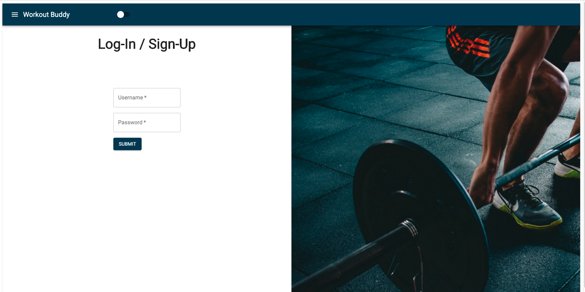
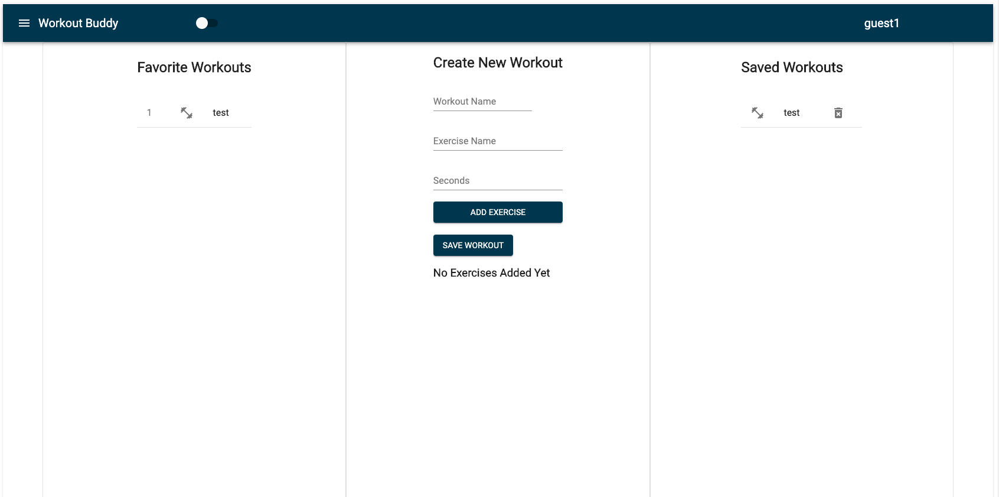
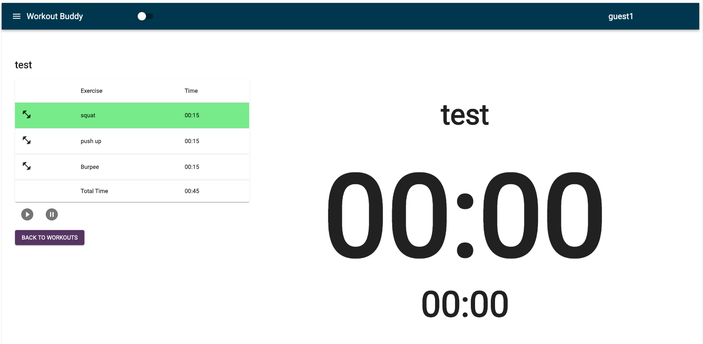
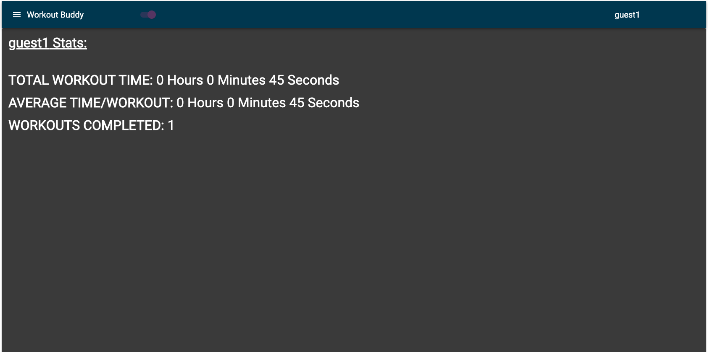
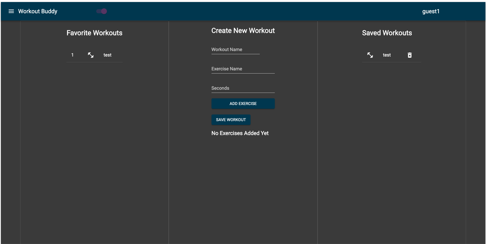

# workout-buddy
Build your own home workout

Live Site: https://workout-bud.herokuapp.com/

### Use/comparison with existing apps:

Workout buddy is an application that allows you to create and run through home workouts. With gyms closed and lots of people doing home workouts, we wanted to make an application to make following a home workout easier. Users will not have to struggle setting timers on their phones or remembering which workouts to perform. There appears to be many mobile applications for following home workouts, but many of these are geared toward preset workouts. The disadvantage of running this on a mobile application is the relatively small size of phones. When you are doing a workout and moving around, it is not easy to read a phone screen. It would be advantageous to see the timer and workout routine on a larger screen and not have to pick up your phone to see instructions between each exercise.

### Sign-Up / Log-In:

This is the landing page of the application and where users can both sign-up and log-in to the application through one form. The form uses passport.js for authentication and users persist as logged in until they close the webpage or logout. When the user signs in it saves their username to session storage so the information can easily be used for other functionalisty.

### Create workout

The create workout page consists of 3 different columns. The Favorite Workouts column which displays the different saved workouts and how many times they have been completed. Next is the Create New Workout column, which is fairly self explanatory. The user adds the workout in the first text box, the name of the exercise in the second and how many seconds they will do the exercise in the seconds textbox. The user then hits the Add Exercise button and the exercise will replace the No Exercise Added Yet text, starting a list of added exercises. The exercise name and seconds text box will clear and the user may add more exercises. The final column is the Saved Workouts list which is a list of buttons that when clicked will take the user to the workouts page and have the user run through the clicked workout. The list items in Saved Workouts also have a trash can icon to delete workouts if the user is so inclined. When the icon is clicked a text box will appear and ask if the user is sure they want to delete. On confirmation the workout will be deleted. 

### Run Workout

The Run Workout page displays a list of the exercises in the workout and their associated times. The user presses the play button located below the list and the two times on the right of screen will display the exercise time on the larger timer and the workout time on the smaller. The pause button will pause the workout but when the play is hit it will revert back to the full time of that particular exercise. 

### User Stats

User Stats are accessed through the hamburger menu and the page displays the total workout time of all workouts completed, the average time per workout and the number of workouts completed. 

### Dark Mode

The application also has a dark mode functionality that can be toggled with the switch on the navbar.

### Tech Used
* MongoDB
* Express
* React
* Node
* Material-Ui
* Passport.js
* React-Hook-Form
* React-Router-Dom
* axios
